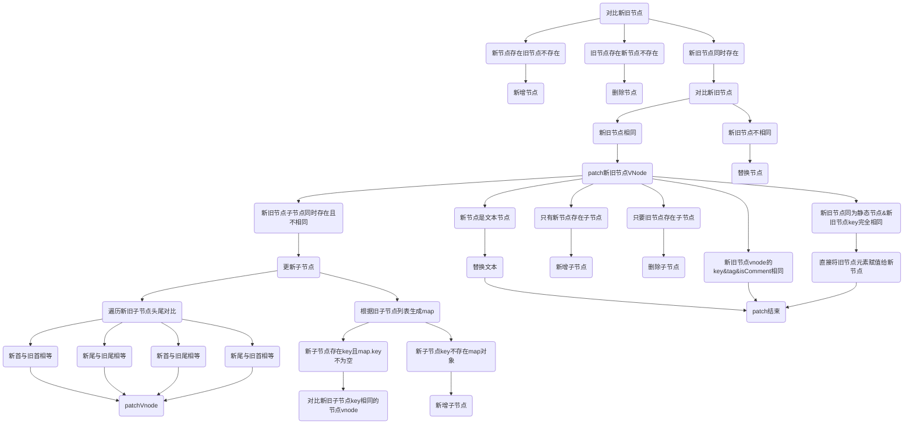

```mermaid
	graph TD
	A(对比新旧节点)-->B1(新节点存在旧节点不存在)
	A-->B2(旧节点存在新节点不存在)
    A-->B3(新旧节点同时存在)
	B1-->C1(新增节点)
	B2-->C2(删除节点)
	B3-->C3(对比新旧节点)
    C3-->D1(新旧节点相同)
    C3-->D2(新旧节点不相同)
    D1-->E1(patch新旧节点VNode)
    D2-->E2(替换节点)
    E1-->F1(新旧节点vnode的key&tag&isComment相同)
    E1-->F4(新旧节点子节点同时存在且不相同)
    F4-->G4(更新子节点)
    G4-->H3(遍历新旧子节点头尾对比)
    G4-->H4(根据旧子节点列表生成map)
    H4-->I5(新子节点存在key且map.key不为空)
    I5-->J2(对比新旧子节点key相同的节点vnode)
    H4-->I6(新子节点key不存在map对象)
    I6-->J3(新增子节点)
    H3-->I1(新首与旧首相等)
    H3-->I2(新尾与旧尾相等)
    H3-->I3(新首与旧尾相等)
    H3-->I4(新尾与旧首相等)
    I1-->J1(patchVnode)
    I2-->J1(patchVnode)
    I3-->J1(patchVnode)
    I4-->J1(patchVnode)
    E1-->F5(只有新节点存在子节点)
    F5-->G5(新增子节点)
    E1-->F6(只要旧节点存在子节点)
    F6-->G6(删除子节点)
    E1-->F3(新节点是文本节点)
    F3-->G3(替换文本)
    G3-->H1(patch结束)
    E1-->F2(新旧节点同为静态节点&新旧节点key完全相同)
    F2-->G1(直接将旧节点元素赋值给新节点)
    F1-->H1(patch结束)
    G1-->H1(patch结束)
```

